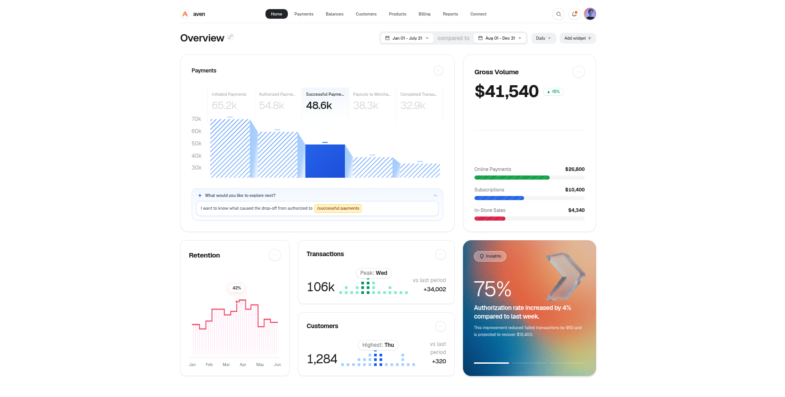

# Aven - Payment and Business Analytics Dashboard UI

A modern financial analytics dashboard concept built with Next.js, Tailwind CSS, and TypeScript. Focuses on actionable clarity, breaking down payment performance, conversion funnels, customer retention, and revenue intelligence into intuitive interactive visual sections.



---

## Features

- **3D Isometric Payment Funnel**: Stepped conversion funnel with sloped 3D vector facets, dynamic blue hover states, and level metrics.
- **Natural Language AI Exploration Bar**: Interactive query prompt bar with real-time `/token` command tag highlighting.
- **Gross Volume and Segment Breakdown**: Primary revenue total paired with diagonal striped progress bars across payment channels.
- **Stepped Retention Chart**: Silhouette boundary area chart with fine vertical striped fill and peak percentage indicator.
- **Activity and Equalizer Cards**: Transactions and Customer distribution cards powered by vertical dot-matrix equalizers and period comparisons.
- **AI Insights Card**: Grainy sunset mesh gradient backdrop with frosted 3D glass geometry and contextual recovery projections.
- **Interactive Header Controls**: Comparative date range capsule with presets, cadence dropdown, and an Add Widget drawer.

---

## Tech Stack

- **Framework**: [Next.js](https://nextjs.org/) (App Router)
- **Styling**: [Tailwind CSS](https://tailwindcss.com/)
- **Icons and Visuals**: Pure custom SVG vector components
- **Language**: TypeScript
- **Package Manager**: pnpm

---

## Getting Started

1. **Clone the repository**:
   ```bash
   git clone git@github.com:mryan-3/aven.git
   cd aven
   ```

2. **Install dependencies**:
   ```bash
   pnpm install
   ```

3. **Run the development server**:
   ```bash
   pnpm dev
   ```

4. **Open in browser**:
   Navigate to `http://localhost:3000`.

---

## License

MIT License.
